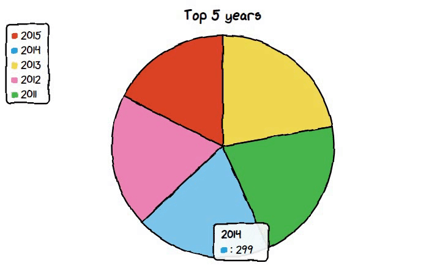
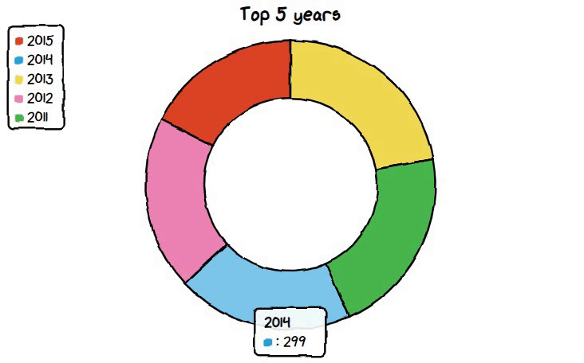
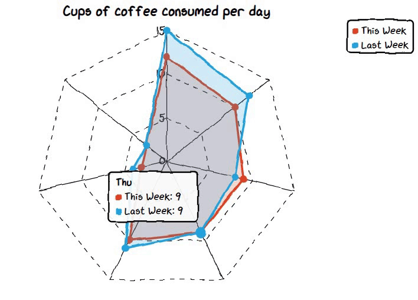
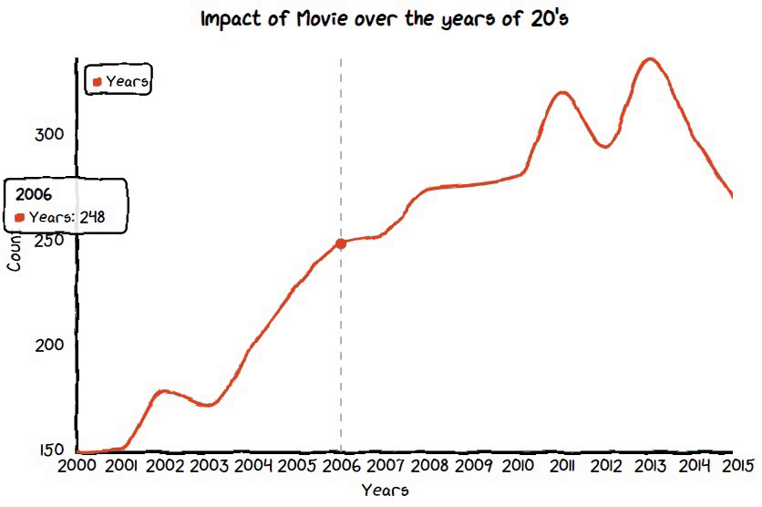
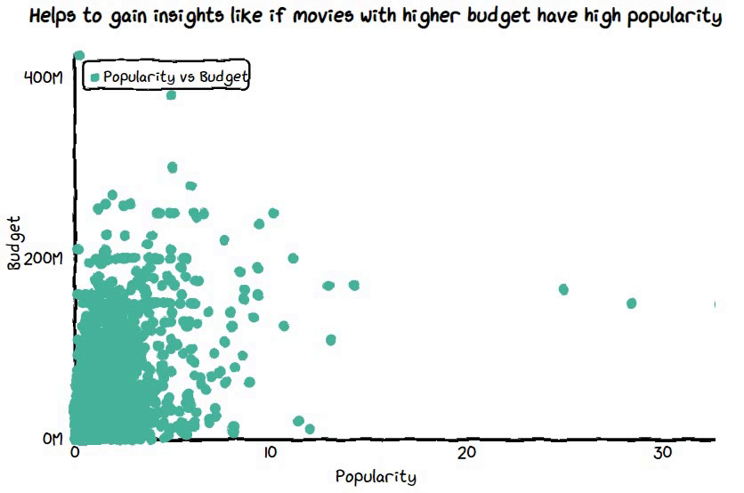

# Cute Charts


- `cutecharts` is used to create 📉 Hand drawing style charts library for Python
- It’s totally different from the regular `matplotlib` and `seaborn` library, it has a lookout of handmade charts and while hovering on the charts it shows us the values.
- The hovering effect is not there in the __matplotlib__ chart which is an advantage of cute charts.
- Creating charts in cute charts is a little bit longer compared to __seaborn__, but a still lesser number of codes than the standard __matplotlib__ library.
- For now, this library support five different charts- `Bar`, `Pie`, `Radar`, `Scatter`, and `Line`.

## Installation
Open command prompt and create new environment
```
conda create -n your_env_name python = (any_version_number)
```
Then activate the newly created environment
```
conda activate your_env_name
```
Clone the repository using `git`
```
git clone https://github.com/Prakashdeveloper03/CuteCharts.git
```
Change to the cloned directory
```
cd <directory_name>
```
Then install all requirement packages for the app
```
pip install -r requirements.txt
```
Then, Open the `CuteCharts.ipynb` notebook
```
jupyter notebook CuteCharts.ipynb
```

## Output Charts

### Pie Chart


### Donut Chart


### Bar Chart


### Radar Chart


### Line Chart


### Scatter Plot

